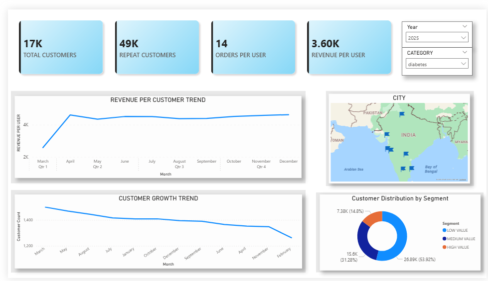
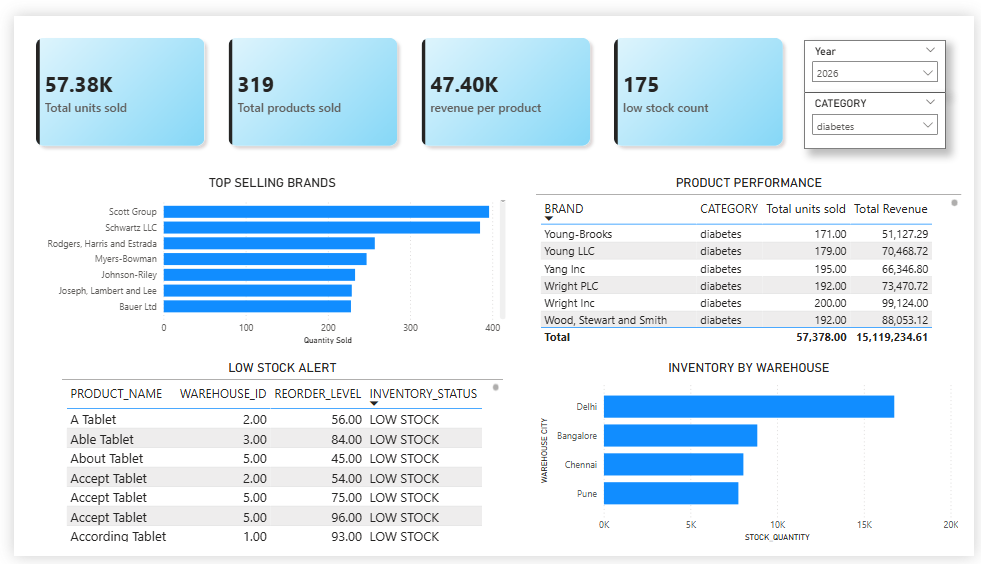

# 💊 Pharma Analytics: End-to-End Data Engineering & BI Project

## 📌 Overview

This project demonstrates a complete end-to-end data pipeline built for a pharmaceutical business.  
It covers data generation, data warehousing, transformation, and business intelligence reporting.

The pipeline enables stakeholders to monitor sales performance, customer behavior, and inventory risks.

---

## 🏗️ Architecture

Python (Data Generation)
↓
Snowflake (Data Warehouse - RAW)
↓
dbt (Staging → Mart → KPI Layer)
↓
Power BI (Dashboards & Insights)

---

## ⚙️ Tech Stack

- **Python** → Data generation
- **Snowflake** → Cloud Data Warehouse
- **dbt (Data Build Tool)** → Data transformation & modeling
- **SQL** → Data manipulation
- **Power BI** → Data visualization
- **GitHub** → Version control

---

## 🧱 Data Model (Star Schema)

### 🔹 Dimension Tables

- `dim_customers` → Customer details
- `dim_products` → Product details
- `dim_category` → Product categories
- `dim_date` → Time dimension
- `dim_city` → Location data
- `dim_warehouses` → Warehouse details

---

### 🔹 Fact Tables

- `fact_orders` → Order-level data
- `fact_order_items` → Product-level transactions (revenue source)
- `fact_inventory` → Stock levels
- `fact_payments` → Payment tracking

---

### 🔹 KPI Layer

- `kpi_sales_summary`
- `kpi_customer_metrics`
- `kpi_product_performance`
- `kpi_inventory_alerts`

---

## 📊 Dashboards

### 📈 1. Executive Overview

- Total Revenue
- Total Orders
- Average Order Value
- Revenue Trends
- Revenue by City & Category

---

### 👥 2. Customer Analytics

- Customer Growth
- Repeat vs New Customers
- Customer Segmentation (High / Medium / Low Value)
- Revenue per Customer
- Top Customers

---

### 📦 3. Product & Inventory

- Top Selling Products
- Revenue by Category
- Inventory Distribution
- Low Stock Alerts
- Demand vs Supply Insights

---

## 🧠 Key Insights

- A small percentage of customers contribute a majority of revenue (Pareto principle)
- Certain product categories dominate sales performance
- Inventory analysis highlights potential stock shortages
- Customer retention plays a significant role in revenue growth

---

## 📸 Dashboard Screenshots

### Executive Dashboard

!(screenshots/Customer Dashboard.png)

### Customer Dashboard

### Product & Inventory Dashboard

